# FoodWise — Multi-College Food Waste Intelligence Platform

> **Status: design document.** This describes the system we are building, delivered in the phases listed in the [roadmap](#17-roadmap). Features are tagged with the phase in which they land.

FoodWise helps college canteens and hostel messes **cook the right amount of food**, learns from **what students actually like**, and, when something unpredictable leaves a large amount of cooked food unserved, **alerts nearby organisations that feed people in need** before the food becomes unsafe.

Any college can sign up, load its own history, and get models trained on its own data.

## Contents

1. [Vision and goals](#1-vision-and-goals)
2. [Personas and roles](#2-personas-and-roles)
3. [Feature overview](#3-feature-overview)
4. [System architecture](#4-system-architecture)
5. [Multi-college tenancy and bring-your-own-data](#5-multi-college-tenancy-and-bring-your-own-data)
6. [ML platform](#6-ml-platform)
7. [Student feedback and preference learning](#7-student-feedback-and-preference-learning)
8. [Surplus rescue](#8-surplus-rescue)
9. [Additional production features](#9-additional-production-features)
10. [Data model](#10-data-model)
11. [API surface](#11-api-surface)
12. [Repository layout](#12-repository-layout)
13. [Security, privacy and compliance](#13-security-privacy-and-compliance)
14. [Reliability and observability](#14-reliability-and-observability)
15. [Deployment and CI/CD](#15-deployment-and-cicd)
16. [Testing strategy](#16-testing-strategy)
17. [Roadmap](#17-roadmap)
18. [Risks and mitigations](#18-risks-and-mitigations)
19. [Assumptions and open decisions](#19-assumptions-and-open-decisions)

---

## 1. Vision and goals

| # | Goal |
|---|------|
| G1 | **Bring your own data.** A college onboards itself, uploads its own service history, and gets a model trained on that data, isolated from every other college. |
| G2 | **Best model, not a fixed model.** Each canteen is served by whichever algorithm wins an honest, time-aware backtest on its own data. |
| G3 | **Cost-aware forecasts.** Output is a probability range plus a recommended preparation quantity that reflects the canteen's own cost of waste versus cost of running out. |
| G4 | **Students in the loop.** Dish ratings, comments, votes and meal RSVPs are processed and fed into the forecast and into menu suggestions. |
| G5 | **Rescue, not just reduction.** When a large unexpected surplus occurs, verified nearby organisations are matched, alerted and tracked inside the food-safety window. |
| G6 | **Production-grade.** Secure, multi-tenant, observable, tested, deployable from CI, and honest about uncertainty. |

**Non-goals (for now):** payments or POS, running a delivery fleet (we coordinate, partners collect), replacing a college's food-safety compliance process (we help record it), native mobile apps (PWA first).

**Success measures** (initial targets, to be re-baselined after the first pilots):

| Area | Measure | Initial target |
|------|---------|----------------|
| Forecast quality | Walk-forward WAPE vs a seasonal-naive baseline | Better on at least 80% of canteen series |
| Waste | Simulated then piloted waste reduction vs manual preparation | At least 20%, validated on real logs rather than assumed |
| Rescue | Median time from incident to first partner acceptance | 20 minutes or less |
| Rescue | Incidents above threshold that end in a confirmed pickup | At least 70% |
| Onboarding | Time from first CSV upload to first forecast | Under one day |
| Feedback | Share of served students who respond | Tracked per canteen, no fixed target until measured |
| Platform | API availability, p95 latency | 99.5%, under 400 ms for reads |

---

## 2. Personas and roles

| Role | Who | Main jobs | Access |
|------|-----|-----------|--------|
| **Platform admin** | FoodWise operator | Create tenants, verify partner organisations, monitor platform health | Whole platform, no tenant data by default |
| **College admin** | Sustainability officer or hostel office | Configure the college, canteens, costs, calendar, thresholds, users, sharing policy | One tenant, full |
| **Canteen manager** | Mess or canteen in-charge | Review and approve forecasts, manage menu, respond to surplus incidents | One tenant, assigned canteens |
| **Kitchen staff** | Cooks, supervisors | Fast daily logging (prepared, served, leftover), report surplus | Logging and incident report only |
| **Student** | Diners | Rate dishes, vote, RSVP or skip a meal | Public QR or PWA, no staff data |
| **Partner coordinator** | NGO, food bank, shelter | Receive alerts, accept pickups, confirm delivery | Own organisation and its offers only |
| **Auditor** | Institution quality or external auditor | Read reports and the audit trail | Read-only |

---

## 3. Feature overview

**R** means requested in the project brief. **A** means added by this design.

| ID | Feature | Origin | Phase |
|----|---------|--------|-------|
| R1 | Multi-algorithm model zoo with automatic, per-canteen model selection | R | P2 |
| R2 | Student feedback collection and preference learning that feeds the forecast | R | P3 |
| R3 | Surplus rescue: detect a large unexpected surplus and suggest nearby organisations | R | P4 |
| R4 | Multi-college tenancy with bring-your-own-data onboarding and per-tenant models | R | P0 to P2 |
| A1 | Probabilistic forecasts (P10 / P50 / P90) and a cost-optimal preparation quantity | A | P2 |
| A2 | Meal RSVP and "skip this meal" | A | P3 |
| A3 | Explainable forecasts in plain language ("rain: -6%, exam week: -9%") | A | P2 |
| A4 | Live intraday tracker with early surplus warning and batch-cooking advice | A | P4 |
| A5 | What-if simulator (fest day, weather, menu change) | A | P5 |
| A6 | Data-quality engine and a data-readiness meter | A | P1 |
| A7 | Drift monitoring, champion/challenger rollout, automatic rollback | A | P2 |
| A8 | Disruption quick actions (event cancelled, exam moved, power cut) with pre-cook scale-down | A | P4 |
| A9 | Impact reporting: kg, ₹, CO2e, meals donated, campus benchmarks | A | P4 |
| A10 | Weekly menu optimiser (preference, variety, cost, waste risk) | A | P5 |
| A11 | Inventory and procurement planning from recipes | A | Stretch |
| A12 | Offline-first kitchen entry mode (PWA) | A | P1 |
| A13 | SSO, role-based access control, audit log | A | P0 |
| A14 | Daily plan digest (email or WhatsApp), approval flow, override reasons, forecast-value-added tracking | A | P2 |
| A15 | Multilingual UI (English and Hindi first) | A | P5 |
| A16 | Public REST API and signed webhooks for mess-software integration | A | P5 |
| A17 | Waste categories (plate waste, unserved surplus, spoilage) and optional smart-scale ingestion | A | P1 |

---

## 4. System architecture

A **modular monolith** for the Node API (one deployable, strict internal module boundaries) plus a separate **Python ML service** and **workers**, because ML workloads scale and fail differently from request/response traffic.

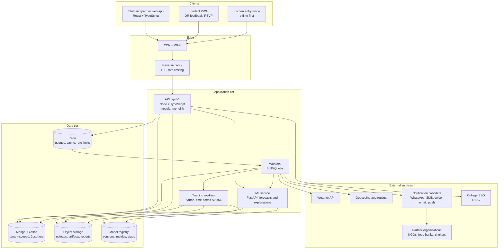

| Component | Responsibility |
|-----------|----------------|
| **API** | AuthN/Z, tenancy, CRUD, validation, orchestration, public feedback and RSVP endpoints, partner endpoints. Never trains models. |
| **Workers** | Scheduled forecasts at each canteen's cutoff time, CSV import processing, report generation, notification waves, retries, drift checks. |
| **ML service** | Stateless inference, explanations, feedback text analysis. Loads the champion model for a tenant and canteen from the registry. |
| **Training workers** | Run the training pipeline ([6.3](#63-training-pipeline)) under a time and cost budget per tenant. Scale to zero when idle. |
| **Registry** | Model versions, metrics, stage (challenger, champion, retired), and links to artifacts. Either self-hosted MLflow or a Mongo-backed table plus object storage (see [section 19](#19-assumptions-and-open-decisions)). |

**Technology choices**

| Layer | Choice | Why |
|-------|--------|-----|
| Web | React 18, Vite, TypeScript, Tailwind, TanStack Query, Recharts, Leaflet | Typed API client, rich charting, open-source maps |
| API | Node 20, Express 5, TypeScript, Zod, auto-generated OpenAPI | Async error handling built in; one schema source shared with the web app |
| Jobs | BullMQ on Redis | Retries, schedules, rate limits, dead-letter handling |
| Database | MongoDB Atlas with Mongoose 8 | Native geospatial queries (`$geoNear`), flexible per-tenant config documents, managed backups |
| ML | Python 3.11, FastAPI, scikit-learn, LightGBM, XGBoost, CatBoost, statsforecast, Optuna, SHAP, MAPIE, Evidently | Strong tabular and time-series tooling, conformal intervals, drift reports |
| Auth | Short-lived JWT access token plus rotating refresh token, OIDC SSO, argon2id | Standard, revocable, college-friendly |
| Observability | pino logs, OpenTelemetry traces, Sentry, Prometheus/Grafana | One trace across API, worker and ML |
| Delivery | Docker, GitHub Actions, optional Terraform | Host-agnostic |

---

## 5. Multi-college tenancy and bring-your-own-data

### 5.1 Tenant hierarchy

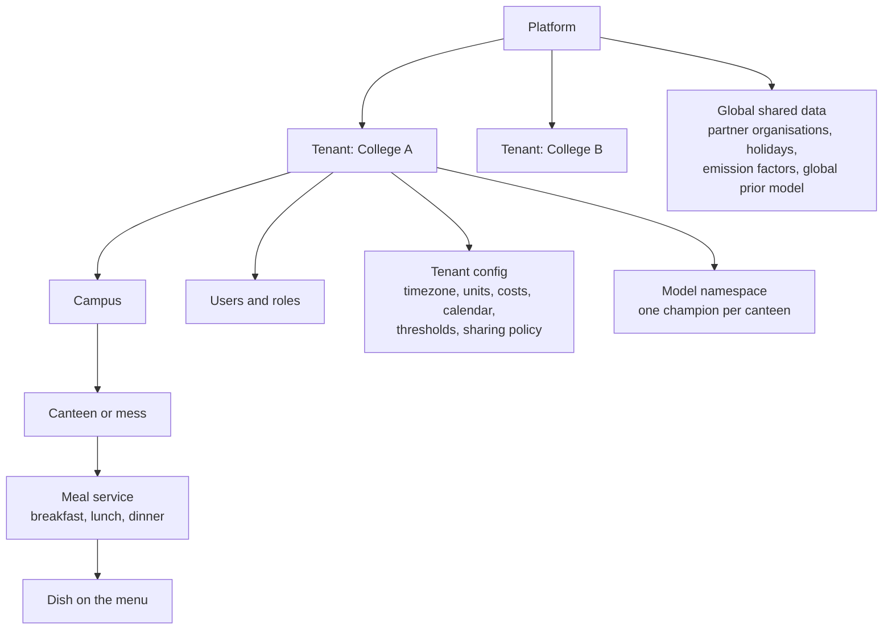

**Isolation rules**

1. Every tenant-owned document carries `tenantId`. A Mongoose plugin injects it into every query; direct model access outside the repository layer is blocked by a lint rule.
2. `tenantId` comes from the verified token, never from the request body or URL.
3. Every compound index starts with `tenantId`.
4. Object-storage keys and model artifacts are prefixed `tenants/{tenantId}/`.
5. An automated cross-tenant suite proves that a user of tenant A receives `404` for tenant B's resources on every endpoint.
6. Large customers can be moved to a dedicated database through connection routing, without code changes.
7. Partner organisations are **platform-global** (one NGO can serve many colleges). Tenants keep private favourites and block lists on top.
8. Cross-college learning is **opt-in**: `dataSharing: none | anonymized_pool`. Default is `none`.

### 5.2 Onboarding flow

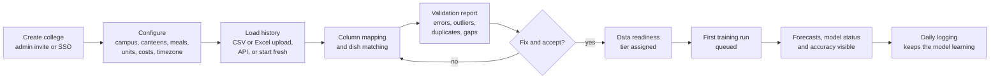

### 5.3 Data ingestion channels

| Channel | For whom | Notes |
|---------|----------|-------|
| CSV / Excel upload with column-mapping UI | Colleges with spreadsheets | Template download, row-level error report, dry-run before commit |
| Daily entry (mobile-friendly, offline-first) | Kitchen staff | Three taps per dish; queues locally when the network drops |
| REST API and webhooks | Colleges with mess software or POS | Idempotency keys, HMAC-signed |
| Attendance feed (ID-card swipes, turnstile, hostel registers) | Larger colleges | Gives true footfall rather than enrolment |
| Smart-scale or IoT ingestion | Advanced canteens | Weight per waste category |

Canonical import template:

```csv
date,canteen,meal,dish,unit,prepared_qty,served_qty,leftover_qty,footfall,sold_out,weather,event
2026-08-18,North Mess,Lunch,Vegetable pulao,plates,350,331,19,1020,false,Clear,
2026-08-19,North Mess,Lunch,Vegetable pulao,plates,360,360,0,1180,true,Rain,Guest lecture
```

`sold_out` matters: when a dish runs out, "served" is only a **lower bound on demand** (censored demand). The pipeline treats those rows differently (see [6.1](#61-problem-framing)).

### 5.4 Data quality engine (A6)

Checks run on every import and on every daily entry:

* Hard rules: `prepared >= served + leftover`, non-negative quantities, known meal and dish, one record per canteen, date, meal and dish.
* Statistical rules: robust z-score outliers, sudden unit changes (plates vs kg), missing days, long constant runs (copy-paste logging).
* Dish matching: fuzzy match ("Veg Pulao" vs "Vegetable pulao") with a human confirm step, mapped to a canonical dish with attributes (cuisine, veg/non-veg, course).
* A **data quality score** per canteen and a **readiness meter** that tells the college exactly what unlocks next ("23 of 60 days. Full model selection unlocks at 60 days").

### 5.5 Readiness tiers (cold start)

New colleges have little data. The system adapts rather than refusing to work.

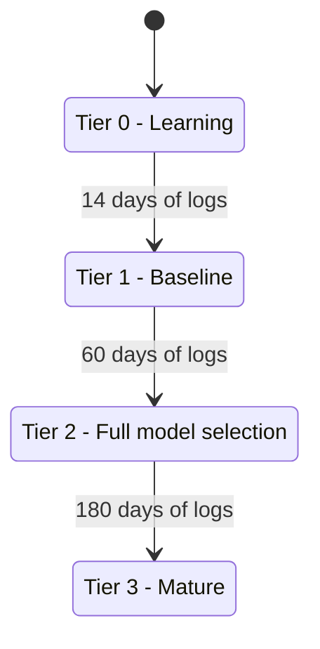

| Tier | History | What the college gets |
|------|---------|-----------------------|
| 0 | under 14 days | Rule-based plan: headcount x portion norms x dish-category priors (from the global prior if the college opted in, otherwise built-in defaults). Wide intervals, clearly labelled "learning". |
| 1 | 14 to 59 days | Baselines and regularised linear models, blended with the global prior. |
| 2 | 60 to 179 days | Full model zoo and per-canteen champion selection. |
| 3 | 180 or more days | Seasonality across a semester, stacked ensemble, calibrated intervals, feedback features (kept only if they pass ablation). |

Thresholds are defaults and are configurable. They will be calibrated in Phase 2 with a synthetic-tenant simulator.

---

## 6. ML platform

### 6.1 Problem framing

* **Target is demand, not consumption.** If a dish sells out, consumption understates demand. Rows with `sold_out = true` are treated as right-censored: excluded from point-model loss or down-weighted, and used as lower bounds in evaluation. A censored-likelihood model is a later upgrade.
* **Output is a distribution.** P10, P50 and P90 per dish and meal, not a single number.
* **Recommended quantity is cost-optimal (A1).** Using the newsvendor result:

  ```
  q* = F⁻¹( Cu / (Cu + Co) )
  Cu = cost of running short (unhappy students, lost revenue)   per unit
  Co = cost of surplus (ingredients, labour, disposal)          per unit
  ```

  Example: if running short costs 1.5 times what a wasted unit costs, the critical ratio is 0.6, so cook at the P60 forecast. A mess with prepaid students that must never run out might use P90. Costs are tenant config.
* **Horizons:** T+1 (default, generated at each canteen's cutoff time), T+7 outlook for procurement, and an intraday re-forecast ([9](#9-additional-production-features)).
* **Three framings, all in the zoo:**

| Framing | How | Best when |
|---------|-----|-----------|
| Direct per dish | One pooled model with dish as a feature | Stable menus, many dishes |
| Two-stage | Meal footfall, then dish share, then portion norm | Rotating menus, choice-based service, brand-new dishes |
| Per-series classical | ETS or SARIMAX on one series | One strong series with little extra data |

Tenant `serviceMode` tells the system which framings make sense: `fixed_thali` (everyone eats the same plate), `choice` (several dishes compete), or `counter` (a la carte).

### 6.2 Model zoo

| Family | Models | Role |
|--------|--------|------|
| Baselines | Seasonal naive (same weekday last week), trailing weighted mean | Always run. Every other model must beat them to be promoted |
| Linear | Ridge, Elastic Net with calendar encodings | Low-data tiers, fully interpretable |
| Classical time series | ETS, SARIMAX (statsforecast) | One-series cases with strong seasonality |
| Gradient boosting | LightGBM, XGBoost, CatBoost | Usually strongest on tabular demand data; LightGBM quantile objective gives P10/P50/P90 |
| Prediction intervals | Conformal wrappers (MAPIE) on any point model | Calibrated intervals for models without native quantiles |
| Neural (optional) | N-HiTS or TFT through a forecasting library | Only with a year or more of data or an opted-in pooled model |
| Ensembles | Non-negative blend or stack over cross-validated forecasts | Often the final champion |

Libraries are suggestions, not commitments; the registry contract (input features, output quantiles) is what stays fixed.

**Feature groups** (all computed **as of** the forecast cutoff, with no future leakage):

| Group | Examples |
|-------|----------|
| Calendar and academic | weekday, week of term, exam period, holiday, vacation, month-end |
| Attendance | RSVP count, hostel residents, day scholars, recent footfall |
| Weather | Forecast temperature and rain probability |
| Menu and dish | course, veg/non-veg, cuisine, days since last served, competing dishes |
| Feedback | smoothed dish score, 28-day trend, vote share, complaint rate |
| History | lags (1, 7, 14, 28), rolling means and deviations, per dish and per meal |
| Events and disruptions | event type and size, learned event impact, disruption flags |

### 6.3 Training pipeline

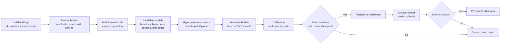

Key rules:

* **Time-aware validation only.** Expanding-window folds; the final fold is a held-out recent period. Random splits are forbidden by a test ([section 16](#16-testing-strategy)).
* **One feature builder** is used by training and serving, which prevents train/serve skew.
* **Bounded compute.** Each tenant gets a time and trial budget per run; runs are queued with fair scheduling across tenants.
* **Reproducible.** Every registered version stores data window, feature list and hash, library versions, seed, folds and metrics.

### 6.4 Model lifecycle: champion and challenger

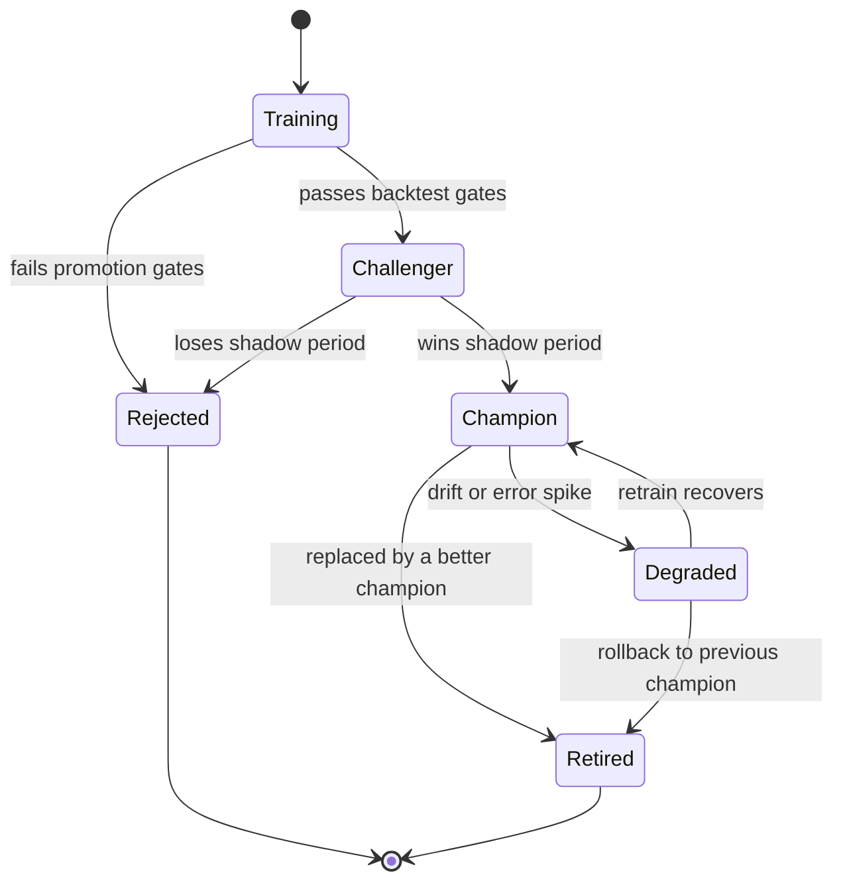

**Promotion gates** (defaults, configurable):

1. Beats the best baseline by a minimum relative WAPE margin.
2. Not worse than the current champion on the same folds, and better in the median.
3. Interval calibration: empirical P90 coverage within ±5 percentage points of nominal.
4. Absolute bias at most 5%.
5. Simulated cost (waste plus shortage) not worse than the champion.
6. Enough history for the tier.

### 6.5 Serving a forecast

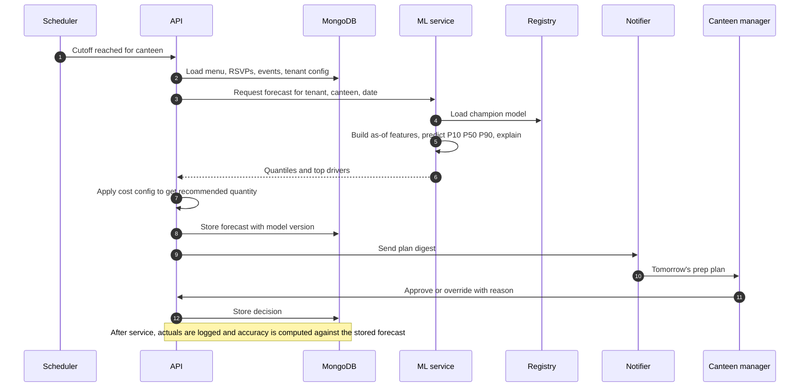

If the ML service is unavailable the API serves a **clearly labelled statistical baseline** computed in the API process. It is never presented as a model forecast.

### 6.6 Monitoring and retraining

| Signal | Method | Action |
|--------|--------|--------|
| Data drift | PSI / KS tests on features (Evidently) | Alert, schedule retrain |
| Error drift | Page-Hinkley or CUSUM on residuals | Mark champion degraded |
| Bias and coverage | Rolling bias, interval coverage | Alert if outside gates |
| Forecast value added | Compare human overrides with model | Show where overrides help or hurt |
| Retrain triggers | Weekly schedule, drift alert, N new logs, menu overhaul, new academic term | Enqueue training |

### 6.7 Explainability (A3)

Tree models use SHAP, linear models use coefficients. Drivers are turned into reason codes a canteen manager can read:

> **Tomorrow, Lunch, Vegetable pulao: cook 312 plates** (likely range 288 to 341)
> Rain forecast −6%, exam week −9%, dish rated 4.3/5 +4%, 1,040 RSVPs.

### 6.8 Evaluation and the waste-reduction claim

* **Forecast metrics:** WAPE, bias, pinball loss per quantile, interval coverage, and skill score against the best baseline.
* **Business metrics:** simulated waste units and ₹, simulated shortage risk, rescue rate.
* **Method:** the same walk-forward backtest is applied to every model. Each recommendation uses only earlier data; results are reported with bootstrap confidence intervals.
* **Honesty rule:** a "≥20% reduction" claim is reported only from real imported logs, with the interval. Backtests on censored (sold-out) days are flagged because they understate demand.
* **Real-world proof:** pilot with a switchback design (alternate weeks or canteens use model guidance) to measure actual effect.

---

## 7. Student feedback and preference learning

### 7.1 What we collect

| Signal | Interaction | Used for |
|--------|-------------|----------|
| Dish rating | One tap: liked / okay / disliked, optional stars | Preference score |
| Aspect tags | Chips: taste, quantity, temperature, freshness, variety | Diagnosing why a dish underperforms |
| Free text | Optional, any language including Hinglish | Sentiment and aspect extraction |
| Portion feedback | Too much / right / too little | Portion norm calibration, plate-waste insight |
| Next-week vote | "Vote for a special" or choose between candidates | Menu optimiser, dish-share model |
| Meal RSVP (A2) | "Eating" or "skipping" by a daily cutoff | Direct demand input |

Channels: a **QR code** on tray-return and dining tables (no login), a **student PWA** link shared by the hostel, and optional college SSO. Each college chooses `anonymous` or `verified` mode; feedback defaults to anonymous.

### 7.2 The feedback loop

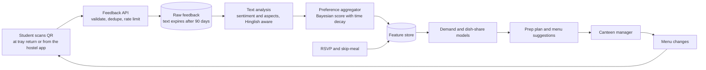

### 7.3 How feedback becomes a model input

**Dish preference score**, smoothed so a dish with three votes does not swing the model:

```
score(d) = ( Σ wᵢ·rᵢ + k·μ ) / ( Σ wᵢ + k )
wᵢ = 0.5 ^ ( ageᵢ / half_life )     recent opinions count more
μ  = canteen-wide mean rating        shrinkage target for sparse dishes
k  = pseudo-count (default 5)
```

Derived features: `dish_score`, `dish_score_trend_28d`, `vote_share_next_menu`, `portion_complaint_rate`, `rsvp_rate`, `rsvp_skip_rate`, `days_since_served`.

Where they act:

1. **Demand model:** as extra features (above).
2. **Dish-share stage:** preference shifts share between competing dishes on choice menus.
3. **Diagnostics:** low rating plus high waste suggests "replace or reduce"; high rating plus sell-outs suggests "increase".
4. **Menu optimiser** ([9](#9-additional-production-features)): picks a weekly menu that maximises preference and variety within cost and nutrition constraints.

**Guardrails**

* **Self-selection bias:** respondents are not a random sample. Scores are reweighted by response rate where group information exists, and shown with their sample size.
* **Earn-your-place rule:** a feedback feature stays in a canteen's model only if an ablation in the backtest shows it improves error. Otherwise the UI says "no measurable impact yet".
* **Minimum evidence:** a score affects the model only after a minimum effective sample size, and is displayed only above a k-anonymity floor (default 5).
* **Integrity:** signed QR tokens per canteen and meal session, valid for the service window plus a grace period; one response per dish per session per device; IP and velocity rate limits; burst and duplicate-text detection; suspected spam is down-weighted.
* **Privacy:** no personal data required; free text is scanned for phone numbers, emails and profanity; raw text has a retention limit while aggregates remain.

Text analysis starts with a multilingual classifier (a lexicon baseline first, then a small open model, with a pluggable LLM option). The contract is the same either way: text in, sentiment plus aspect scores out.

---

## 8. Surplus rescue

When something unpredictable happens (an event is cancelled, a strike or storm empties the campus, a late announcement) the canteen can be left with a large amount of cooked food. FoodWise detects it, checks it is safe to donate, finds the right nearby organisations, notifies them in waves, and tracks the handoff.

### 8.1 Detection

There are four triggers, and the response differs depending on whether the food is already cooked.

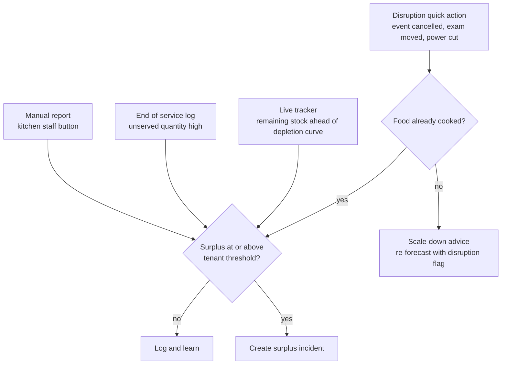

**Default threshold** (per tenant, editable): surplus of at least the larger of a minimum absolute quantity (for example 20 portions or 5 kg) and the canteen's historical P95 waste. This is the definition of "large amount" and can be tightened or loosened per college.

**Best response first:** if food is not yet cooked, the cheapest fix is to cook less. Disruption actions trigger an immediate re-forecast and scale-down advice before any donation flow.

### 8.2 Food-safety gate

Donation is only useful if the food is still safe. Before any partner is contacted, the incident must pass:

* Each item records **cooked time**, storage state (hot-held, chilled, ambient), packaging, diet (veg, non-veg, egg, Jain), and allergen notes.
* The system computes a **safe-until** time per food category and storage state. The windows are **tenant-configurable defaults that a food-safety officer must review** against local rules (for example, India's FSSAI surplus-food recovery and distribution regulations; verify the current text before launch). The system ships no hard-coded safety claim.
* If safe-until has passed, or the time left is shorter than the minimum useful window, the incident is **diverted** to compost, biogas or animal-feed partners instead of human consumption.
* A countdown is shown on every offer. An organisation that cannot arrive before safe-until minus a handling buffer is filtered out.

### 8.3 Finding and ranking nearby organisations

**Where partners come from**

| Level | Source | Behaviour |
|-------|--------|-----------|
| L0 Discovered | Open map data (such as OpenStreetMap social-facility tags) or directory import | Shown as candidates, never auto-alerted |
| L1 Registered | Self-registered, phone and email verified | Can be invited by a college |
| L2 Verified | Registration number, address and contact checked by the platform team or the college | Eligible for automatic alerts |
| L3 Trusted | Track record of successful pickups and good receiver ratings | Higher ranking weight |

Map-data licences require attribution. No external organisation is contacted until it opts in and reaches L2.

**Matching**

```
eligible = verified level ≥ L2
         AND open at (now + travel time)
         AND accepts (food category, diet)
         AND travel time + handling buffer ≤ safe_until − now
         AND capacity ≥ minimum useful quantity
         AND not blocked and not in cooldown

score    = 0.35·proximity(ETA) + 0.20·capacity_fit + 0.20·reliability
         + 0.10·verification_level + 0.10·need_priority + 0.05·rotation_fairness
```

Weights are configurable. Candidates come from a geospatial query (`$geoNear` on a `2dsphere` index), are re-ranked by real **travel time** from a routing API, and a large surplus is **split across partners** when no single partner has the capacity. A rotation term and a cooldown prevent the same organisation from being pinged on every incident and protect against alert fatigue.

### 8.4 Alert waves and handoff

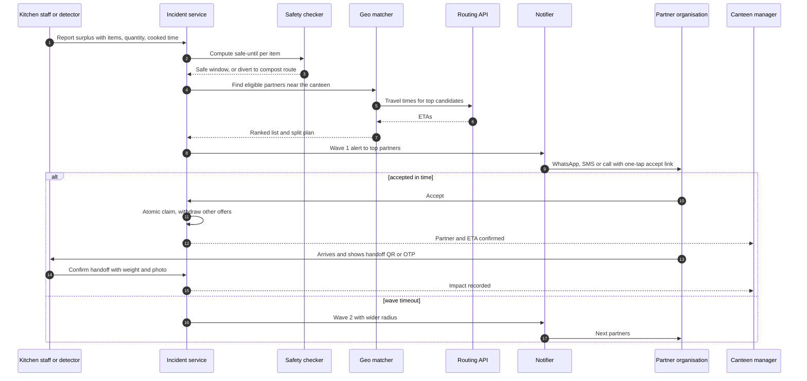

| Wave | Audience | Timeout | Channels |
|------|----------|---------|----------|
| 1 | Top 3 eligible partners | Shorter of 10 minutes or 20% of remaining safe time | WhatsApp or SMS, plus push |
| 2 | Top 5, radius doubled | Same rule | Add voice call |
| 3 | All eligible plus volunteer drivers | Same rule | All channels |
| Fallback | Compost, biogas, animal feed | n/a | Standard offer |

The accept link is a signed, expiring URL, so a partner does not need an account to say yes. Acceptance uses an **atomic claim** so two partners cannot both win. A partner no-show returns the incident to the offered state automatically.

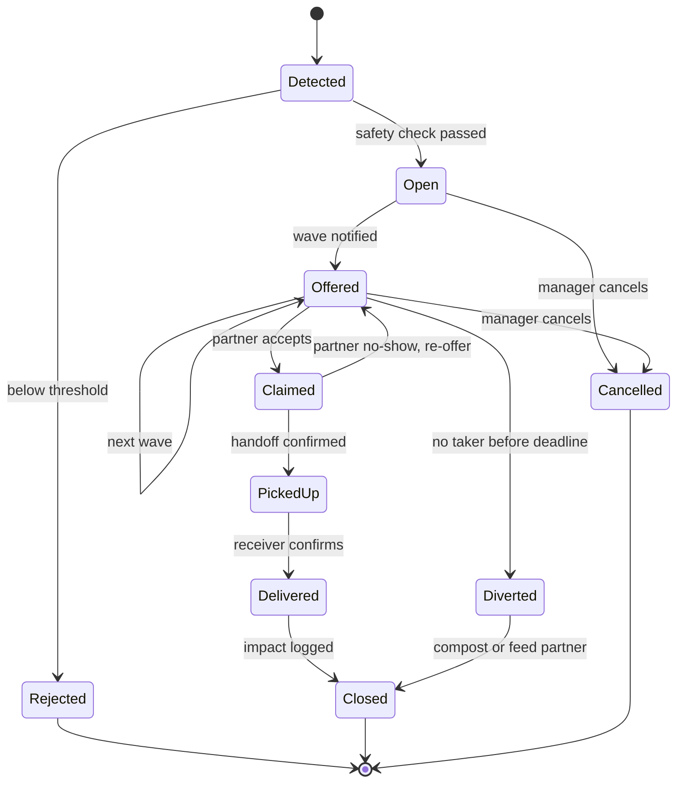

### 8.5 Proof, impact and gaps

* **Handoff proof:** OTP or QR at pickup, weight, photo, and receiver confirmation. Temperature log if the college records it.
* **Impact record** per incident: kg and meals diverted from waste, estimated CO2e avoided (configurable emission factor per food category, with its source documented), and rescue time. Feeds impact reports and certificates for the college.
* **Coverage gap analysis:** a map of partner coverage around each canteen, plus a prompt to onboard partners when no eligible organisation exists within the maximum radius.
* **Privacy:** partners see only what they need (food, quantity, safe-until, pickup point, contact). No student data is ever shared.
* **Disclaimer:** this system records and coordinates donations. It does not replace the college's legal and food-safety obligations. Legal terms and liability wording need review by the college and counsel before launch.

---

## 9. Additional production features

| Feature | What it does | Why it matters |
|---------|--------------|----------------|
| **Live intraday tracker (A4)** | Staff tap "service started" and log remaining stock a few times per service (or read POS/turnstile counts). A learned depletion curve per meal predicts the final leftover. | Early warning during service; supports batch cooking (for example 60/25/15) and pre-warms a surplus incident |
| **What-if simulator (A5)** | Enter headcount, weather, event or menu change and see the forecast distribution and expected waste and shortage | Planning for fests, exam weeks and menu changes |
| **Disruption quick actions (A8)** | One tap: "event cancelled", "exam moved", "power cut", "holiday declared" | Fast re-forecast and the pre-cook scale-down path |
| **Impact and benchmarks (A9)** | kg, ₹, CO2e, meals donated; trends; optional anonymised benchmarks for colleges that opt in to pooling | Reporting and motivation |
| **Menu optimiser (A10)** | Weekly menu that maximises preference and variety within budget, nutrition, diet rules and no-repeat windows (constraint solver or heuristic); manager approves | Turns feedback into action |
| **Inventory and procurement (A11, stretch)** | Recipes map dishes to ingredients; forecast becomes an ingredient requirement; stock, expiry and FIFO alerts | Cuts raw-material waste, not only cooked waste |
| **Offline-first kitchen mode (A12)** | PWA that queues entries without a network and syncs with conflict handling | Kitchens have patchy connectivity |
| **Plan digest and approvals (A14)** | Daily WhatsApp or email plan, approve or override with a reason, forecast-value-added tracking | Fits the manager's routine and measures whether overrides help |
| **Waste categories (A17)** | Plate waste, unserved surplus, spoilage and prep waste tracked separately | Different causes need different fixes |
| **SSO, RBAC, audit log (A13)** | OIDC with college accounts, role permissions, append-only audit trail | Required by institutions |
| **Public API and webhooks (A16)** | Versioned REST API, HMAC-signed webhooks (`forecast.generated`, `incident.created`, `incident.claimed`) | Integration with mess software |
| **Multilingual UI (A15)** | English and Hindi first, string catalogs for more | Staff and students use different languages |

---

## 10. Data model

Logical model (MongoDB collections; embedded versus referenced choices noted below the diagram).

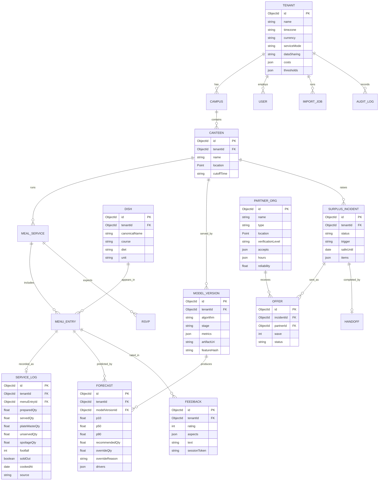

Design notes:

* Raw feedback is high volume, so it is stored with a TTL on free text and rolled up daily into aggregates used by the model.
* `FORECAST` keeps the model version and the human override, which is what makes real accuracy and forecast-value-added possible.
* Key indexes: `{tenantId, canteenId, serviceDate}` on logs and forecasts, `2dsphere` on `PARTNER_ORG.location` and `CANTEEN.location`, TTL on feedback text and expired accept links, unique `{tenantId, canteenId, date, meal, dish}` on logs.
* `PARTNER_ORG`, holidays and emission factors have no `tenantId` (global). Tenant-specific relationships (favourites, blocks) live in a small link collection.

---

## 11. API surface

Versioned under `/api/v1`, OpenAPI generated from the Zod schemas, cursor pagination on every list.

| Module | Representative endpoints |
|--------|--------------------------|
| Auth | `POST /auth/login`, `POST /auth/refresh`, `POST /auth/logout`, `GET /auth/sso/:provider` |
| Tenants and users | `GET/PATCH /tenant`, `POST /users/invite`, `GET /users` |
| Canteens, dishes, menus | `/canteens`, `/dishes`, `/menus`, `/meal-services` |
| Service logs | `GET/POST /logs`, `POST /logs/bulk` (idempotent) |
| Imports | `POST /imports` (upload), `GET /imports/:id/report`, `POST /imports/:id/commit` |
| Forecasts | `GET /forecasts?date=`, `POST /forecasts/generate`, `PATCH /forecasts/:id` (approve or override), `POST /forecasts/whatif` |
| Models | `GET /models`, `GET /models/:id/metrics`, `POST /models/train`, `POST /models/:id/promote` |
| Feedback (public, signed token) | `POST /public/feedback`, `POST /public/rsvp`, `GET /public/session/:token` |
| Feedback (staff) | `GET /feedback/summary`, `GET /feedback/dishes/:id` |
| Incidents | `POST /incidents`, `GET /incidents/:id`, `POST /incidents/:id/cancel`, `GET /incidents/:id/events` (SSE) |
| Partners | `GET /partners/nearby`, `POST /partners` (register), `POST /partners/:id/verify` (platform admin) |
| Partner portal | `GET /partner/offers`, `POST /partner/offers/:id/accept`, `POST /partner/offers/:id/decline` |
| Impact and reports | `GET /impact/summary`, `GET /reports/waste.pdf`, `GET /reports/logs.csv` |
| Webhooks | `GET/POST /webhooks`, `POST /webhooks/:id/test` |
| Health | `GET /health/live`, `GET /health/ready` |

**ML service (internal only):** `POST /v1/forecast`, `POST /v1/explain`, `POST /v1/feedback/analyze`, `POST /v1/jobs/train`, `GET /v1/models/:id`, `GET /health`.

---

## 12. Repository layout

```text
foodwise/
├─ apps/
│  ├─ web/               # staff and partner web app (React + TS, role-based layouts)
│  ├─ student/           # student PWA (small bundle, public, QR entry)
│  ├─ api/               # Express 5 + TS modular monolith
│  └─ worker/            # BullMQ workers (imports the API's module code)
├─ services/
│  └─ ml/                # FastAPI inference + training pipeline
│     ├─ foodwise_ml/
│     │  ├─ features/    # as-of-safe feature builder (single source of truth)
│     │  ├─ models/      # one adapter per algorithm
│     │  ├─ selection/   # walk-forward CV, tuning, ensembling, gates
│     │  ├─ feedback/    # text analysis, preference aggregation
│     │  └─ monitoring/  # drift and calibration
│     └─ tests/
├─ packages/
│  ├─ contracts/         # Zod schemas, generated OpenAPI, shared TS types
│  └─ ui/                # shared design system
├─ infra/                # Dockerfiles, docker-compose, IaC
├─ docs/                 # ADRs, runbooks, data dictionary, partner onboarding guide
├─ scripts/              # seed, synthetic tenant simulator, maintenance scripts
└─ .github/workflows/    # CI/CD
```

API module layout (each module owns its routes, service, repository, schemas and tests):

```text
apps/api/src/
├─ platform/   # config, tenancy plugin, RBAC, errors, logging, queue
└─ modules/    # auth, tenants, canteens, menu, logs, imports, forecasts, models,
               # feedback, rsvp, incidents, partners, notifications, impact,
               # reports, audit, webhooks
```

Conventions: Conventional Commits, one ADR per significant decision in `docs/adr/`, and no cross-module imports except through a module's public interface.

---

## 13. Security, privacy and compliance

| Area | Plan |
|------|------|
| Authentication | Short-lived access token, rotating refresh token in an httpOnly cookie, argon2id hashing, optional MFA, OIDC SSO for colleges, lockout and rate limiting on login |
| Authorisation | RBAC with permission checks in a single middleware, tenant scope enforced in the data layer |
| Tenant isolation | Rules in [5.1](#51-tenant-hierarchy), proven by a cross-tenant test suite |
| Input handling | Zod validation on every route, no raw request bodies into the database, size limits, upload type and size checks, malware scan on uploads |
| Transport and headers | TLS everywhere, Helmet, strict CORS allow-list, CSRF protection for cookie flows |
| Public endpoints | Signed per-session tokens, per-IP and per-device limits, bot challenge on abuse |
| Secrets | Secret manager or platform env, never in the repository, rotation runbook |
| Dev credentials | Seed credentials exist only in local development and are blocked in production builds |
| Student privacy | Anonymous by default, no personal data required, free-text PII scan, retention limits, deletion on request |
| Partner data | Verified contacts only, minimum necessary details in offers, no student data shared |
| Auditability | Append-only audit log of logins, role changes, overrides, incident decisions and exports |
| Supply chain | Dependency and container scanning, lockfiles, secret scanning, SBOM |
| Backups | Continuous database backup with point-in-time restore, tested restore runbook |
| Compliance posture | Design for India's DPDP Act 2023 and GDPR-style principles (consent, purpose limitation, retention, erasure). Confirm obligations with counsel for each launch region |

---

## 14. Reliability and observability

**Service objectives** (initial)

| Objective | Target |
|-----------|--------|
| API availability | 99.5% monthly |
| p95 read latency | under 400 ms |
| Daily forecast delivered before canteen cutoff | 99% of canteen-days |
| Surplus alert dispatched after incident passes safety gate | under 60 seconds |

**Observability:** structured logs with request and tenant IDs, OpenTelemetry traces across API, worker and ML service, metrics and dashboards (Prometheus/Grafana), error tracking (Sentry), and **model dashboards** (accuracy, bias, coverage, drift, champion age) per tenant.

**Graceful degradation**

| Failure | Behaviour |
|---------|-----------|
| ML service down | Serve a labelled statistical baseline; queue a retry |
| Database reconnecting | Health endpoint reports degraded, API answers 503 with retry guidance, client shows a recovery state, automatic reconnect with backoff |
| Notification provider down | Circuit breaker and channel failover (WhatsApp, then SMS, then voice) |
| Worker crash | Idempotent jobs, retries with backoff, dead-letter queue and alert |
| Kitchen offline | Entries queue locally and sync later |

---

## 15. Deployment and CI/CD

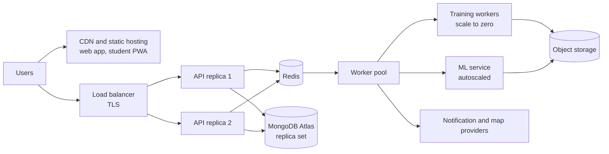

Environments: **local** (`docker compose up` for API, worker, ML, Mongo, Redis, MinIO), **staging** (mirrors production, synthetic tenants), **production**. The container images are host-agnostic, so the same build runs on Render, Railway, Fly.io or a cloud container service, with the frontends on a CDN host.

```mermaid
flowchart LR
  PR["Pull request"] --> L["Lint and typecheck"]
  L --> UT["Unit tests<br/>Node and Python"]
  UT --> IT["Integration tests<br/>Mongo and Redis containers"]
  IT --> CT["Contract tests<br/>OpenAPI diff"]
  CT --> MT["ML regression<br/>golden-dataset backtest"]
  MT --> SEC["Security scans<br/>dependencies, secrets, images"]
  SEC --> BLD["Build images"]
  BLD --> STG["Deploy to staging"]
  STG --> E2E["End-to-end smoke tests<br/>Playwright"]
  E2E --> PRD["Deploy to production<br/>manual approval"]
```

---

## 16. Testing strategy

| Layer | What is tested |
|-------|----------------|
| Unit | Business rules, scoring, safe-until calculation, partner ranking, newsvendor quantity |
| Property-based | Feature builder never uses data after the cutoff; quantities stay non-negative; ranking is stable under permutation |
| Leakage guard | A test fails if any split is not time-ordered or any feature reads future rows |
| Tenant isolation | For every endpoint, tenant A cannot read or write tenant B (expects 404) |
| ML regression | Golden datasets with known metrics; a new code change cannot silently worsen backtest error |
| Synthetic tenant simulator | Generates colleges with known ground truth (weekday effects, rain, events, preference) to verify models recover signal and to calibrate tier thresholds |
| Integration | API with real Mongo and Redis containers; import pipeline; incident state machine end to end |
| Contract | OpenAPI diff blocks breaking changes; webhook payload schemas |
| Load | k6 against forecast, public feedback and incident dispatch |
| Resilience | ML down, DB down, provider down, worker crash |
| End to end | Playwright flows: onboarding, daily log, forecast approval, student feedback, surplus rescue |
| Security | AuthZ matrix tests, dependency and container scans, abuse tests on public endpoints |
| Accessibility | WCAG 2.1 AA checks on the student PWA and kitchen mode |

---

## 17. Roadmap

Indicative effort assuming **2 to 3 engineers**; a solo developer should roughly double it. Phases 3 and 4 can run in parallel.

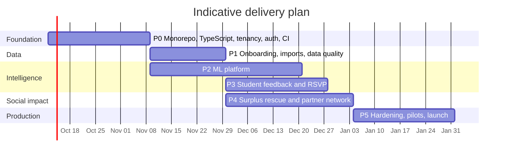

| Phase | Scope | Exit criteria |
|-------|-------|---------------|
| **P0 Foundation** | Monorepo, TypeScript, Express 5, Zod, tenancy plugin and isolation tests, RBAC, SSO, refresh tokens, CI, Docker Compose, a demo tenant with synthetic data | Two test tenants cannot see each other; CI green; no default credentials outside dev |
| **P1 Data** | Canteen/meal/dish model, import pipeline with mapping and validation report, data quality score, readiness meter, offline kitchen mode, waste categories | A new college imports a CSV and sees its readiness tier in minutes |
| **P2 ML platform** | Feature builder, model zoo, walk-forward selection, quantiles and conformal intervals, newsvendor quantity, registry, champion/challenger, drift monitoring, explanations, plan digest and overrides | Per-canteen champion chosen automatically; beats baselines on the golden datasets; leakage test passes |
| **P3 Feedback and RSVP** | Public signed-token endpoints, student PWA, text analysis, preference aggregator, feedback features with ablation gate, RSVP as demand input | Feedback features are tested in backtest and kept or dropped automatically |
| **P4 Surplus rescue** | Incident engine, safety gate, partner registry and verification, geo ranking and routing, waves and notifications, partner portal, handoff proof, impact records, live tracker, disruption actions | End-to-end drill with real test partners completes inside a safe window |
| **P5 Hardening and launch** | Load and resilience tests, security review, backups and restore drill, SLO dashboards, what-if simulator, menu optimiser, API and webhooks, i18n, pilots with two or three colleges | Pilot colleges run for four weeks with measured waste reduction and rescue metrics |
| **Stretch** | Inventory and procurement, computer-vision waste estimation, pooled neural models, benchmarks | After pilot feedback |

---

## 18. Risks and mitigations

| Risk | Mitigation |
|------|------------|
| New colleges have too little data | Readiness tiers, global prior (opt-in), clear "learning" labels, never fake output |
| Few students give feedback, and respondents are biased | One-tap UX, QR at the tray, RSVP incentives, reweighting, ablation gate, display sample size |
| Partner organisations are slow or unreachable | Waves, verified track record, volunteer and compost fallbacks, coverage-gap prompts |
| Food-safety or liability concerns | Configurable safe-until windows reviewed by a food-safety officer, handoff proof, clear terms, legal review before launch |
| Alert fatigue for partners | Thresholds, rotation, cooldowns, frequency caps, minimum useful quantity |
| Manual logging quality | Validation, offline mode, three-tap entry, anomaly flags, data quality score |
| ML cost grows with tenants | Time-boxed training, queueing, scale-to-zero workers, retrain only on triggers |
| Complexity of many models | Single registry contract, adapters per algorithm, promotion gates, ADRs |
| Messaging provider approvals and cost | Provider abstraction, email and push as no-approval fallbacks, budget per tenant (SMS in India needs sender and template registration; confirm requirements) |
| Privacy exposure | Anonymous by default, minimisation, retention limits, access logging |

---

## 19. Assumptions and open decisions

These defaults were chosen to keep the plan moving. Each can be changed before Phase 0 starts.

| # | Decision | Default in this design | Alternative |
|---|----------|------------------------|-------------|
| 1 | Language for API and web | TypeScript (strongly recommended for a multi-module production codebase) | Plain JavaScript |
| 2 | Primary database | MongoDB Atlas (native geospatial, flexible tenant config) | PostgreSQL with PostGIS if relational reporting dominates |
| 3 | Model registry | Mongo-backed registry plus object storage | Self-hosted MLflow |
| 4 | Partner onboarding | Curated and self-registered, verified before alerts; open map data used only for discovery | Fully platform-curated, or college-curated only |
| 5 | Data pooling across colleges | Off by default, opt-in anonymised pooling | Always on, or never |
| 6 | Student identity | Anonymous feedback; device token or SSO for RSVP | SSO for everything |
| 7 | Notification channels | Email and push first; WhatsApp or SMS added with provider approval | Different regional providers |
| 8 | Hosting | Host-agnostic containers | A single cloud vendor |
| 9 | Launch region | India first (rupees, English and Hindi, Indian holidays) | Region-neutral from day one |
| 10 | Roadmap sizing | 2 to 3 engineers | Solo developer (double the durations) |

### Glossary

| Term | Meaning |
|------|---------|
| WAPE | Weighted absolute percentage error: total absolute error divided by total actual |
| Walk-forward validation | Train on the past, test on the next period, then roll forward, so tests never use the future |
| Censored demand | Observed sales understate demand when an item sold out |
| Newsvendor quantity | The quantity that balances the cost of surplus against the cost of running short |
| Conformal prediction | A method to wrap a model so its intervals have the stated coverage |
| Champion / challenger | The live model versus a candidate being tested before it replaces it |
| PSI | Population stability index, a measure of data drift |
| Safe-until | The latest time at which cooked food is still suitable for donation |
